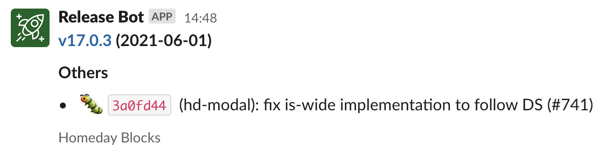

# Creating a GitHub Action for your Slack release BOT

Almost all of us love Slack applications and BOTs that automate something. It could be from an alert, so you're notified as soon as a problem happens, or just a random good morning GIF. In this short tutorial, I would like to go through the process of creating a GitHub Action that posts a message as soon as a release happens (that is our use case) but the main topic is how you can automate things with GitHub Actions, how to reuse "things" across multiple actions and how to start "simple".

At Homeday we use such a process to announce new releases from our component library [Homeday Blocks](https://github.com/homeday-de/homeday-blocks) to our `#frontend` Slack channel and also to announce product releases to the relevant squad's channels. The release BOT looks like the one below:



## Pre-requisite

You need to have a Slack application to perform the next steps. Slack has great documentation on how to setup a new application: https://api.slack.com/start

The main feature/functionality your application needs to have is: "Incoming Webhooks". It will allow you, later, to create a webhook that will post a message where you want. Each webhook will have an unique URL which you should keep private.

## Creating a GitHub Action to trigger the webhook

GitHub Actions got quite popular in the past 1-2 years and are a good way to setup continuous integration to our applications on GitHub. It has way more features than just "run tests on every pull request" but I will leave it up to their docs to walk you through the multitude of options it offers: https://docs.github.com/en/actions

In short, a workflow has a name, a trigger, and job(s). The name helps us to easily identify what the workflow is supposed to do. The trigger defines when the workflow will run, for example, every push, every pull request, every comment, every release... The jobs are a sequence of steps that the workflow will perform, these can be GitHub Actions. Again, GitHub docs will do a better job than me explaining each of these blocks.

I would like to start creating a generic workflow that will trigger for every push:

```yml
# Action name
name: CD

# Action triggers
on:
  push:
    branches:
      - main

 # Action jobs
 jobs:
  deploy:
    runs-on: ubuntu-latest
    steps:
      - uses: actions/checkout@v2.3.4
      - run: npm ci
      - run: npm run build:app
      - run: npm run deploy
 ```

 The workflow above is an example of how you can build and deploy your application for every push on `main`. Now let's enhance it to notify a channel, on Slack, every time the application is deployed.

```yml
# Action name
name: CD

# Action triggers
on:
  push:
    branches:
      - main

 # Action jobs
 jobs:
  deploy:
    runs-on: ubuntu-latest
    steps:
      - uses: actions/checkout@v2.3.4
      - run: npm ci
      - run: npm run build:app
      - run: npm run deploy
  slack:
    needs: deploy
    runs-on: ubuntu-latest
    steps:
      - uses: actions/checkout@v2.3.4
      - name: Get latest commit info
        run: |
          echo "::set-output name=TITLE::$(git show -1 --format='%s' -s)"
        id: latest_commit
      - name: Announce on Slack 📢
        run: |
          curl ${{ secrets.SLACK_RELEASE_BOT_WEBHOOK_URL }} \
            --request POST \
            --header 'Content-type: application/json' \
            --data \
              '{
                "blocks": [
                  {
                    "type": "header",
                    "text": {
                      "type": "plain_text",
                      "text": "${{ steps.latest_commit.outputs.TITLE }}"
                    }
                  }
                ]
              }'
 ```

 It adds a job by the end, called `slack`. This jobs `needs` the `deploy` job to run first so we only announce the release after the deployment. It gets the latest commit message to be used as release title (this is completely open to customization) and afterward, it sends a POST request to our webhook.

 Two things are important to mention here:
 - `SLACK_RELEASE_BOT_WEBHOOK_URL` is defined as a secret in the repository
 - We reference the output of one step in another step with the help of `set-output` and `id`

 Now, after deployment, we will have a message with the commit message in Slack. Quite similar to the intro image, the main difference is that there I've added some other blocks into the message.

 ## How to reuse it?

 It works fine for the application we setup but now we need to add it to another application. The easiest way to do it is to copy-paste. It works fine until it doesn't 😅

 If we want to keep consistency or help others to setup their workflows, copying a "random" `curl` might not be the best experience and can lead to a lot of errors, we can create our own GitHub Action. Clear advantages are easy to reuse and, most important, documentation.

 Again, GitHub Actions docs do a great job here but it might lead you to unanswered questions, like: which kind of action should I create? Docker? Javascript? Composite?

 The simplest, for this scenario, way to share the `curl` step through different workflows is creating a composite action. Composite actions allow you to group a sequence of steps without much extra setup. All you need is one file by the end.

*There is, of course, one limitation. Composite actions won't allow you to reuse other actions inside of it. In short: you can't use the `uses` key in your steps.*

You need to create a new repository and add a file called `action.yml`. This file will have the following template:

```yml
name: Slack Release BOT
description: Slack Release BOT used by us
inputs:
  webhook_url:
    required: true
    description: Slack webhook URL
  title:
    required: true
    description: Message title
runs:
  using: 'composite'
  steps:
    - shell: bash
      run: |
        curl ${{ inputs.webhook_url }} \
          --request POST \
          --header 'Content-type: application/json' \
          --data \
            '{
              "blocks": [
                {
                  "type": "header",
                  "text": {
                    "type": "plain_text",
                    "text": "${{ inputs.title }}"
                  }
                }
              ]
            }'
```

The `inputs` allow you to pass data from your main workflow to this action through `with`, the full example will show it. We encapsulated the `curl` into its own action, allowing all applications to use it once we push the code to our repository.

The example below shows how the main workflow will look like given that we have the above action under `github-username/my-action`:

```yml
# Action name
name: CD

# Action triggers
on:
  push:
    branches:
      - main

 # Action jobs
 jobs:
  deploy:
    runs-on: ubuntu-latest
    steps:
      - uses: actions/checkout@v2.3.4
      - run: npm ci
      - run: npm run build:app
      - run: npm run deploy
      slack:
        needs: deploy
        runs-on: ubuntu-latest
        steps:
      	  - uses: actions/checkout@v2.3.4
      	  - name: Get latest commit info
            run: |
              echo "::set-output name=TITLE::$(git show -1 --format='%s' -s)"
            id: latest_commit
      	  - uses: github-username/my-action@main
            with:
              webhook_url: ${{ secrets.SLACK_RELEASE_BOT_WEBHOOK_URL }}
              title: ${{ steps.latest_commit.outputs.TITLE }}
 ```

 Instead of performing the `curl` ourselves, we just use the new action, and using `with` we can pass the required variables.

 Now we have a centralized repository where we can standardize the release, make its usage easier, and, on top of that, document what is going on, which would be hard if you just copy a `curl` from another workflow.

 ## How about the next steps?

 There are other ways to create an action: docker and javascript. They are indeed more advanced and give you more flexibility, not something required by our example at the moment. In case we need to start adding conditions, fetch different, data and not so "step by step" approach, it makes sense to go for a Docker/Javascript action as it will become easier to manipulate data there.

 The idea here is to start simple and develop further only if needed. You can group a sequence of steps using a composite action and reuse them across all your applications. It is also important to follow a release process and avoid that applications crash in case something gets updated.

 ---

 If you would like to check the actual final code from our Slack release BOT Action, you can check it in this repository: https://github.com/homeday-de/slack-release-bot-action

 Feel free to use it if it helps you. You can also check this pull request where we replace a `curl` step with the new action for every release of our component library: https://github.com/homeday-de/homeday-blocks/pull/744
