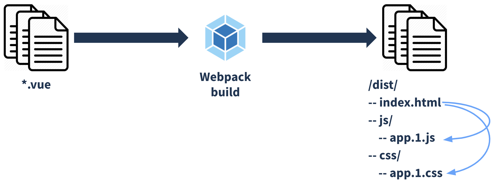
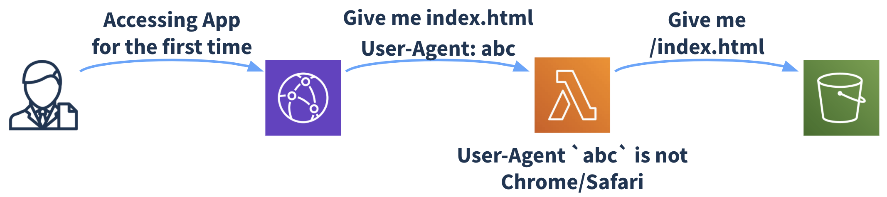
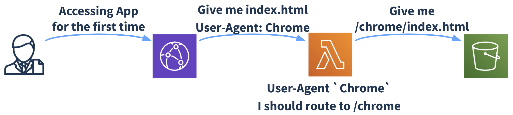
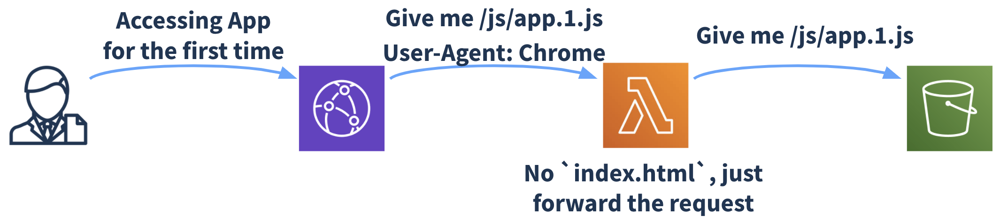

# Multiple builds targeting different browsers

Every quarter at [Homeday](https://www.homeday.de) we have something called PEW. PEW stands for Product Engineering Week, which translates to a week where you cancel all your meetings and work on a topic you would like to explore. It can be done in groups or alone, it is up to you. Last PEWs I've done work regarding tests, assets compression and some Puppeteer as a service. This quarter I decided to go for build optimization and I would like to explore the topic in this article.

## My idea

> How about building different versions of our applications targeting different browsers so each browser downloads only the "fallbacks" it needs?

That is in short what I thought. Now I'm going to explore how is our current development lifecycle and where we can try to add this idea.

## Development lifecycle

At Homeday we build mainly SPAs using Vue. So by the end of our development lifecycle we create a bunch of assets that are uploaded to S3 (in our case) and work as an application.

To "create a bunch of assets" we use Webpack which builds our code, creating one version of it at the end. This version is used by all our clients, which means that lots of different browsers will be using this very same version. Below you can visualize the current build process, from code to assets.



By "different browsers will be using this very same version" I mean that we have to be ready for some old browsers (some applications still need to support IE 11 which has a significant market share for us). So basically our version should support IE 11 and also the latest version on Chrome, for example. IE 11 doesn't have the same Javascript/CSS support as the latest Chrome, so at the end our code fallback to something that works on IE 11, adding polyfills and transpiling what is needed. This adds some extra Kb to our assets which the latest Chrome users don't need but they end up downloading.

The theory is exactly that one. The thing I needed to check now if how feasible it would be to ship different code for both browsers or how many browsers we would like to split it.

## Targeting browsers when building

When we build our application using Webpack there are different loaders that ensure our code becomes a single (or multiple) JS/CSS file at the end. Well known loaders like [`babel-loader`](https://github.com/babel/babel-loader) and [`postcss-loader`](https://webpack.js.org/loaders/postcss-loader/) ensure that our code works cross browser. The open question is: How do they know which browsers they have to fallback to? They can have their own defaults but there should be, somehow, a way to specify which browsers it should take into consideration.

There is one file called `.browserslistrc` (or an entry in `package.json`) that specify the browsers you expect your project to support. This file has a well defined structure and has its own project: [`browserslist`](https://github.com/browserslist/browserslist). Loaders, like `babel-loader` and `postcss-loader`, use the browsers you specify in your `.browserslistrc` file to know which browsers they have to fallback to.

You can define not just one browser but a range of browsers with `browserslist`, I recommend you to check the project if you're not aware how to define those queries.

Now that we can specify the browsers we want to support, we need to check the browsers' distribution among our projects and check the savings we could have when targeting them in the build process. The browsers' distribution comes from Google Analytics in our case. I did this process for 3 of our projects and summarized it below:

- Project 1:
  - Current build (which supports IE 11 but doesn't need it): 273Kb
  - Chrome 84: 241Kb (12% - 32Kb)
  - Safari 13: 250Kb (9% - 23Kb)

- Project 2:
  - Current build (which suuports IE 11 and it is necessary): 302Kb
  - Chrome 84: 269Kb (11% - 33Kb)
  - Safari 13: 277Kb (8% - 25Kb)

- Project 3:
  - Current build (which supports IE 11 and it is necessary): 544Kb
  - Chrome 83+: 504Kb (8% - 40Kb)
  - Safari 13: 516Kb (5% - 28Kb)
  
*All values are GZIP and counts for all JS + CSS files generated in the build*

All in all modern browsers can save between ~20Kb - ~40Kb which is definitely a good number (it is not as good as the results I've got from Brotli compression during another PEW work but it is definitely something that we can work on).

Now that the idea is valid, it is time to implement it. The first step is to do multiple builds of our projects.

## Multiple builds

Using browserslist we can specify [different environments](https://github.com/browserslist/browserslist#configuring-for-different-environments) which allows us to set an environment variable (`BROWSERSLIST_ENV`) to select which environment we want to build to.

Now you can read the `.browserslistrc` file and select which environments are set and build based on them. We created a small script that does this job. You can setup it differently, what matters at the end is the possibility of running one command and building all the different versions.

```javascript
const { readConfig } = require('browserslist/node');

const browserslistConfig = readConfig('.browserslistrc');
const browserslistConfigKeys = Object.keys(browserslistConfig).filter((_) => _ !== 'defaults'); // Browserslist default is removed and built separately

browserslistConfigKeys.forEach((key) => {
  // Here we build the app like: BROWSERSLIST_ENV=${key} npm run build:production
});
```

*I've removed parts of the code that are not necessary for the example.*

So right now what happens is the following:
- We have a `.browserslistrc` file with environments set
```
since 2019

[chrome]
chrome 84

[safari]
safari 13
```
- We build for each environment
  1. Load first envionment, which is `chrome` in this case.
  2. Call `BROWSERSLIST_ENV=chrome npm run build:production`
  3. The entry point will be in `/dist/chrome`, so we will have `/dist/chrome/index.html` and `/dist/js/...`
  4. Load second envionment, which is `safari` in this case.
  5. Call `BROWSERSLIST_ENV=safari npm run build:production`
  6. The entry point will be in `/dist/safari`, so we will have `/dist/safari/index.html` and `/dist/js/...`
  7. Build default case
  8. Call `npm run build:production`
  9. The entry point will be in `/dist`, so we will have `/dist/index.html` and `/dis/js/...`

What we can note from here is that we still have the default `/dist/index.html` working as expected and all the assets are in the shared folders, `/dist/js` for example. The image below summarizes this process.


Let's check where we are going. We have multiple `index.html` files now. Each `index.html` points to a different entry point, a `.js` file in this case. This `.js` file is located in `/dist/js`. So what we need to do now is to route the browser to the specific `index.html` that uses the built version of our app for that browser.

## Routing multiple builds

Once we're done with multiple builds of our application we can simply deploy it. Deploy means copying the files under `/dist` to somewhere, which is S3 in our case. What happens now is that our application works exactly as before. The reason behind it is that our `default build` creates `/dist/index.html` which is exactly how we were building our project.

What we need to do now is to route some of the requests to the new `index.html` files, under `/chrome` and `/safari` sub-directories. We need to route only `index.html` as all the assets are living in the same sub-directories (`/js` and `/css`) as before.

At Homeday we have CloudFront in front of S3 which means we can levarage the powers of Lambda@Edge. Lambda@Edge allows you to run a Lambda function (if you're not familiar, please check the [official docs](https://aws.amazon.com/lambda/) within CloudFront lifecycle events. You can also check the [Lambda@Edge official docs](https://aws.amazon.com/lambda/edge/) if you want to go deeper in the topic.

We can place a Lambda function between CloudFront and S3, which allows us to route the request to S3 based on the `User-Agent` that we get from the request. We can compare the `User-Agent` with our queries in the browserslist definition and decide which route to take or just go to the default one (which would be the case without this Lambda function). This process should happen only for `index.html` and `service-workers.js` as we have a PWA here. The Lambda function can look like the following:

```javascript
const { matchesUA } = require('browserslist-useragent');
const { readConfig } = require('browserslist/node');

const INDEX_HTML_REGEX = /\/index\.html/;
const SERVICE_WORKER_REGEX = /\/service-worker\.js/;
const BROWSERSLIST_CONFIG = readConfig('.browserslistrc');
const BROWSERSLIST_KEYS = Object.keys(BROWSERSLIST_CONFIG).filter((_) => _ !== 'defaults');

exports.handler = async (event) => {
  const { request } = event.Records[0].cf;
  const { uri, headers } = request;

  if (INDEX_HTML_REGEX.test(uri) || SERVICE_WORKER_REGEX.test(uri)) { // You can do it in the same Regex or leave it explicit as we do
    const userAgent = getUserAgentFromHeaders(headers);

    console.log('uri', uri);
    console.log('userAgent', userAgent);

    const path = BROWSERSLIST_KEYS.find((key) => {
      const browsers = BROWSERSLIST_CONFIG[key];
      const options = {
        browsers,
        allowHigherVersions: true,
      };

      return matchesUA(userAgent, options);
    });

    if (path) {
      console.log(`Redirect to ${path} version`);

      return { ...request, uri: `/${path}${uri}` };
    }

    console.log('Serving default version');
  }

  return request;
};
```

Once the user downloads the "right" `index.html`, it will fetch the required assets and serve the right version of the application for that user. There are 3 images below that represent the request scenarios. Consider that none of the files are cached in CloudFront/Browser.

Requesting `index.html` from a random browser that is not Chrome/Safari, which means we fallback to default (or what we had before). Lambda function doesn't do any routing job now and just forwards the request.


Requesting `index.html` from a Chrome browser, which means we should route to `/chrome/index.html`. Lambda function detects the `User-Agent` and routes the request to the right file, in this case `/chrome/index.html`.


Requesting `app.1.js` from a Chrome browser. As it is not `index.html` we shouldn't do anything. Lambda function doesn't do any routing job now and just forwards the request.


## Things to consider

All in all the described approach works as expected. Nevertheless there are other things I would recommend doing as well:

- Do not build for specific browsers. Build for a range of browsers. If you build for Chrome 83 and Chrome 84, for example, the changes of having the same output are quite high. Play with Browserslist queries and find the one that fits you best, also take a look into your analytics to understand the best approach to take.
- Your build time is going to increase. You can build in parallel as well but at the end it is going to increase. So leverage the amount of builds you would like to have.
- If you use CDN, as we use CloudFront, forwarding a header will imply on "loosening" your caching strategy, so have it in mind and do not forward all the headers. In this case we need just `User-Agent`.
- Automate and make use of IaC (Infrastructure as Code). As we've everything in AWS, I end up using CloudFormation. Actually I used AWS SAM, as it makes it easier to define Lambda functions, but at the end I still need to use CloudFormation syntax for CloudFront distribution for example.
  - This step can be done completely in a next iteration but I definitely recommend you to check it out. Imagine you update your `.browserslistrc` file. You need to deploy your Lambda again. Publish it. Update CloudFront distribution to use it. And whatever comes after. If everything is automated, at the end you run a command that does all those steps for you.
  - If you use CloudFront as well and you're outside `us-east-1` you will have few issues with Lambda@Edge as this function should be in `us-east-1` and not in any other region to work.
- Another way of achieving something similar is using [bdsl-webpack-plugin](https://github.com/TrigenSoftware/bdsl-webpack-plugin). This approach has some drawbacks and it becomes cumbersome when using Service Workers. Nevertheless it is a way easier to be implemented.
  
## Thank you for coming this far =]

I hope you enjoyed this article as much as I enjoyed exploring this topic. The benefits of such approach are quite clear but the implementation is a bit overwhelming.

We, Homeday, are currently not using it in production and I'm keen to give it a try and collect some metrics. I love to explore this kind of topic and work beyond the code, exploring architecture improvements and so on. I hope in the next PEWs I can explore similar topics and share our learnings as well!